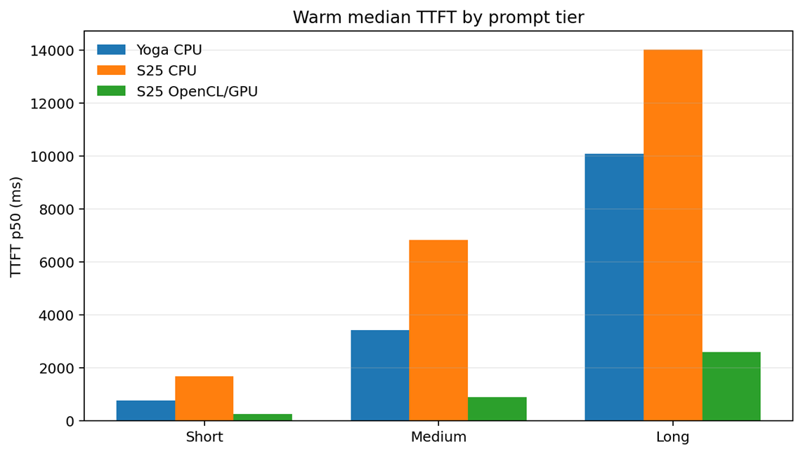
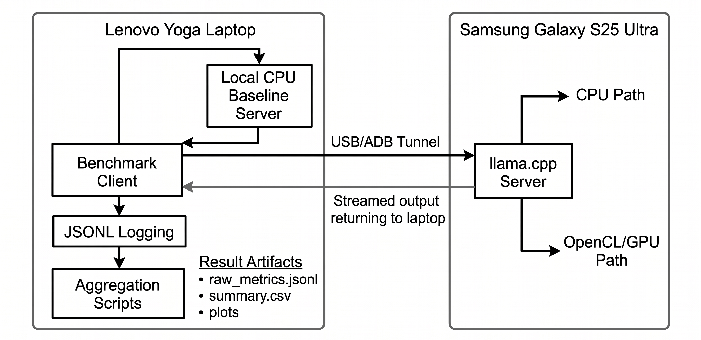

# Reverse-Tethered LLM Inference Benchmark

[](Dissertation%20-%20Jiuk%20Kim%20(Signed).pdf)

**Can a flagship Android phone, used as a headless compute node over USB, deliver faster LLM inference than a legacy laptop?**

This repository contains the measurement harness, automation scripts, analysis tooling, and experiment protocol for a dissertation research project that benchmarks [llama.cpp](https://github.com/ggerganov/llama.cpp) inference performance across a **laptop CPU baseline** and a **reverse-tethered Android phone** connected via USB/ADB.

---

## 🏆 Key Findings

The benchmark demonstrates that using a modern smartphone as an external OpenCL/GPU compute node significantly improves first-token responsiveness compared to a legacy laptop CPU.


*(Figure: Warm median Time-to-First-Token by prompt tier and condition. Lower is better.)*

* **Substantial TTFT Speedup:** The S25 Ultra OpenCL/GPU condition improved laptop-boundary Time-to-First-Token (TTFT) by approximately **3.01x for short prompts, 3.88x for medium prompts, and 3.90x for long prompts** against the laptop CPU baseline.
* **Phase-Specific Improvement:** The Decode Tokens Per Second (TPS) throughput was broadly comparable to the laptop baseline rather than universally superior. The reverse-tethered architecture is primarily effective for reducing prompt-processing and first-token wait times.

---

## ⚙️ How It Works (System Architecture)


*(Figure: Implemented reverse-tethered architecture including the ADB/USB path and boundary measurements.)*

1. The laptop (client) sends an HTTP request to `localhost:8080`.
2. ADB forwards that port over USB to the phone's local llama.cpp server.
3. The phone performs tokenization, prefill, and autoregressive decoding.
4. Streamed tokens flow back to the laptop where **TTFT** and **Decode TPS** are measured strictly at the client boundary (reflecting real user-perceived latency).

For the **laptop baseline**, the same client targets a local llama.cpp instance, ensuring a fair and identical measurement path.

## 📊 Key Metrics

| Metric | Definition |
|--------|-----------|
| **TTFT** (Time to First Token) | Elapsed time from request send to first non-empty token received on the laptop. |
| **Decode TPS** | Token generation rate during the decode window only (computed after the first token arrives). |

## 💻 Hardware

| | Laptop | Phone |
|-|--------|-------|
| **Device** | Lenovo Yoga Slim 7 (14ARE05) | Samsung Galaxy S25 Ultra |
| **SoC / CPU** | AMD Ryzen 7 4700U | Snapdragon 8 Elite |
| **GPU** | — (CPU-only baseline) | Adreno 830 (OpenCL) |
| **RAM** | 16 GB | 12 GB |
| **OS** | Windows 11 | Android 15 (Termux) |

## 📂 Repository Structure

```text
reverseTether/
├── assets/                  # Diagrams and result plots used in the README
├── client/                  # Python benchmark harness (CLI + benchmark engine)
│   ├── cli.py               #   Single-run CLI entry point
│   ├── matrix.py            #   Multi-regime matrix runner
│   ├── benchmark.py         #   Core benchmark execution & SSE streaming
│   └── metrics.py           #   TTFT / Decode TPS computation
├── scripts/                 # Shell helpers (ADB setup, server launch, token validation)
├── configs/                 # Versioned prompt suites and matrix run conditions
├── analysis/                # Post-run aggregation and plot generation scripts
├── tests/                   # Automated unit & integration tests
├── results/                 # Raw JSONL logs and derived summaries (git-ignored)
├── docs/                    # Detailed runbooks and logging schemas
├── ARCHITECTURE.md          # System design and measurement boundaries
├── EXPERIMENT_PROTOCOL.md   # Canonical experiment methodology
└── Dissertation - Jiuk Kim (Signed).pdf  # Full research dissertation
```

## 🚀 Getting Started

### Prerequisites

- **Python 3.11+**
- **ADB** installed and on your `PATH`
- A **USB cable** connecting the phone to the laptop
- **llama.cpp** built on the phone (see [Phone Server Runbook](docs/phone_server_runbook.md))
- A **GGUF model** (e.g., `Llama-3.2-1B-Instruct-Q4_0`) available on both devices

### 1. Install Python Dependencies

```bash
python -m venv .venv
# Windows
.venv\Scripts\activate
# Linux/macOS
source .venv/bin/activate

pip install -r requirements.txt
```

### 2. Set Up the Phone (One-Time)

On the phone in Termux, build llama.cpp with OpenCL support. See [docs/phone_server_runbook.md](docs/phone_server_runbook.md) for detailed instructions.

### 3. Start the Phone Server

```bash
# Launch llama.cpp server on the phone (via Termux or adb shell)
./scripts/launch_phone_server.sh --cpu          # CPU-only
./scripts/launch_phone_server.sh --gpu          # GPU/OpenCL
```

### 4. Establish the ADB Bridge

On the laptop:

```bash
./scripts/adb_bootstrap.sh
```
This forwards `localhost:8080` on the laptop to port `8080` on the phone.

### 5. Run a Benchmark

```bash
# Single run — phone, CPU backend, warm start, short prompt
python -m client.cli --node s25u --backend cpu --run-type warm --prompt-tier short

# Matrix run — all regimes, 5 repetitions
python -m client.matrix --node s25u --backend cpu \
    --regimes cold,warm,soak --repetitions 5 --prompt-tier short
```

### 6. Analyze Results

```bash
python analysis/aggregate.py --input results/ --output results/summaries/
```

## 🔬 Experiment Conditions & Regimes

**Conditions:**
All conditions use identical generation settings: `Q4_0` quantization, seed `42`, temperature `0.0`, 2048-token context, and 512 max output tokens.
1. `yoga_cpu_local`: Laptop CPU-only baseline
2. `s25u_cpu_phone`: Phone CPU over reverse tether
3. `s25u_gpu_opencl_phone`: Phone GPU/OpenCL over reverse tether

**Regimes:**
* **Cold**: Measures first-request latency after a fresh server launch.
* **Warm**: Normal interactive use with the model already loaded.
* **Soak**: Sustained load to observe trends over time.

## ⚠️ Scope and Limitations

* **Implemented Acceleration Path:** This study implements and evaluates an **OpenCL/GPU** path. It does not claim NPU acceleration or fully optimized CUDA-level offloading.
* **Measurement Boundaries:** The benchmark intentionally measures the *complete* laptop-boundary path. TTFT includes ADB/USB transport latency and server overhead, reflecting actual user experience rather than isolated phone compute speed.
* **Thermal Testing:** The soak regime provides sustained-performance trends only. Due to the lack of reliable hardware telemetry in the logs, it is not presented as causal proof of thermal throttling.

## 📖 Citation & Read the Paper

For complete methodology, statistical summaries, and in-depth discussions on phase-aware LLM serving over reverse-tethered connections, please read the full dissertation included in this repository:
👉 **[Read the Dissertation (PDF)](Dissertation%20-%20Jiuk%20Kim%20(Signed).pdf)**

## 🧪 Testing

```bash
python -m unittest discover -s tests -v
```